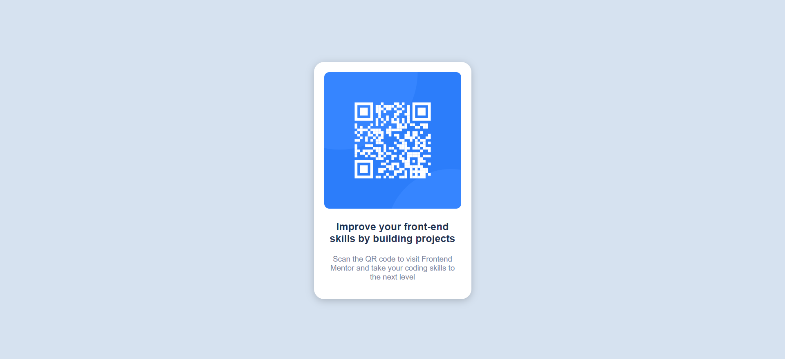

# Frontend Mentor - Product preview card component solution
This is a solution to the QR Code Component challenge on [Frontend Mentor](https://www.frontendmentor.io/challenges/qr-code-component-iux_sIO_H). 

## Table of contents

- [Overview](#overview)
  - [Screenshot](#screenshot)
  - [Links](#links)
- [My process](#my-process)
  - [Built with](#built-with)
  - [Useful resources](#useful-resources)
- [Author](#author)

## Overview

### Screenshot

-Desktop view

-Molbile view

### Links

- Solution URL: (https://github.com/priyanshu-mishr/qr-code-component.git)
- Live Site URL: (https://priyanshu-mishr.github.io/qr-code-component/)

## My process

### Built with

- Semantic HTML5 markup
- CSS custom properties
- Flexbox
- Desktop-first workflow

### Useful resources

- [Google Fonts](https://fonts.google.com/) 

## Author

- Frontend Mentor - [@priyanshu-mishr](https://www.frontendmentor.io/profile/priyanshu-mishr)

